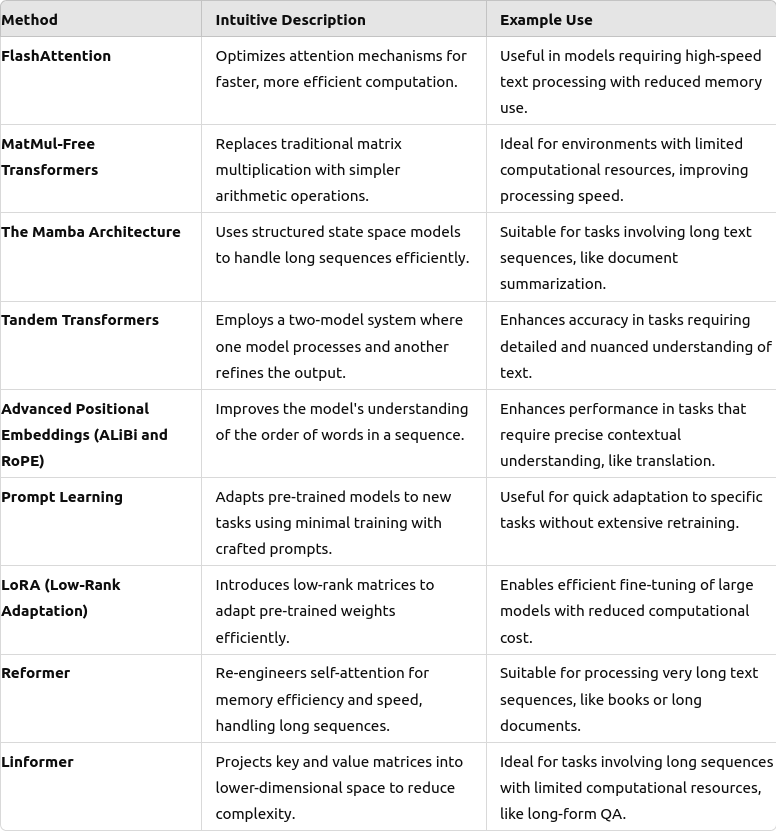

# Recent Methods in Transformers

This repository contains the Jupyter notebook "Recent Methods in Transformers.ipynb," which provides a detailed exploration of cutting-edge techniques in transformer models. Each method is explained with intuitive descriptions, some mathematical insights, and simple implementations.



## Covered Methods

- **FlashAttention**: Optimizes the efficiency of attention mechanisms, reducing computational and memory demands.
- **MatMul-Free Transformers**: Eliminates traditional matrix multiplication in favor of simpler arithmetic operations to speed up processing.
- **The Mamba Architecture**: Leverages structured state space models to handle long sequences more efficiently by focusing on selective memory mechanisms.
- **Tandem Transformers**: Utilizes a two-model system where the primary model processes input and a secondary model refines the output, enhancing performance.
- **Advanced Positional Embeddings (ALiBi and RoPE)**: Enhances the understanding of sequence order, improving positional awareness in tasks requiring deep contextual interpretation.
- **Prompt Learning**: Adapts pre-trained models to new tasks using minimal training, by employing carefully crafted prompts to direct the model's focus.
- **LoRA (Low-Rank Adaptation)**: Introduces low-rank matrices to transformer models to adapt pre-trained weights effectively with minimal alterations to the model's architecture.
- **Reformer**: Re-engineers the self-attention mechanism to optimize for memory efficiency and speed, suitable for processing very long sequences.
- **Linformer**: Projects self-attention mechanism's key and value matrices into a lower-dimensional space, reducing memory and computational requirements.

## Getting Started

To get started with this repository, you will need to have Python installed, along with Jupyter Notebook or JupyterLab to run the notebook. It's also recommended to have a virtual environment set up.

### Prerequisites

- Python 3.8+
- Jupyter Notebook or JupyterLab
- Required Python libraries:
  ```bash
  pip install torch transformers numpy matplotlib
  ```

### Running the Notebook

1. Clone the repository:
   ```bash
   git clone https://github.com/galenwilkerson/Recent-Methods-in-Transformers.git
   ```
2. Navigate to the repository directory:
   ```bash
   cd Recent-Methods-in-Transformers
   ```
3. Install dependencies:
   ```bash
   pip install -r requirements.txt
   ```
4. Launch Jupyter Notebook or JupyterLab:
   ```bash
   jupyter notebook
   # or
   jupyter lab
   ```
5. Open the `Recent Methods in Transformers.ipynb` notebook and run the cells.

## Contributing

Contributions to this project are welcome! Please feel free to fork the repository and submit a pull request. For major changes, please open an issue first to discuss what you would like to change.

## License

This project is licensed under the MIT License - see the [LICENSE](LICENSE) file for details.
